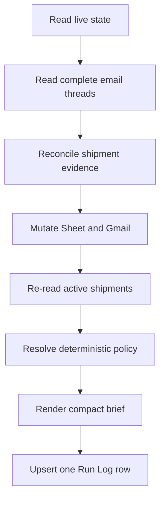

# Architecture

## Authorities

| Concern | Authority |
|---|---|
| Tasks, controls, routes, trips, run history | Ops Status Register |
| Active fulfillment | `Shipments` tab in Ops Status Register |
| Company-paid mileage and gross estimate | Mileage & Pay Tracker |
| Order/receipt history | Gmail labels and archived threads |
| Behaviour and invariants | This repository and installed Ops Brief skill |
| Schedule | Exactly two ChatGPT automations |

Mutable state is never copied into scheduled prompts or Git. The scheduled jobs only select AM or PM and invoke the policy.

## Brief transaction

The post-mutation shipment read is the only shipment state allowed in the rendered brief.

## Failure model

- A required Sheet read, policy execution, or required mutation failure is `Error`.
- A failed non-authoritative evidence source is `Degraded`; the brief still completes.
- A failed source is attempted once per run. There are no recursive agents, retry loops, or supporting scheduled jobs.
- Ambiguous shipment evidence never changes multiple rows; it becomes an explicit exception.

